# Makers Coding Bootcamp Portfolio

This portfolio is under construction. This is a draft.

The [Makers Software Engineering Bootcamp](https://makers.tech/) is a 12 week, full-time, onsite course. Here is the portfolio that shows evidences of my learnings. The repositories shared in this document are not meant to be perfect but to show the progression in each of the topics listed in the Table of Contents below.  

---

## Table of Contents

- [Makers Coding Bootcamp Portfolio](#makers-coding-bootcamp-portfolio)
  - [Table of Contents](#table-of-contents)
  - [I can make anything](#i-can-make-anything)
    - [I can TDD anything](#i-can-tdd-anything)
    - [I can program fluently](#i-can-program-fluently)
    - [I can debug anything](#i-can-debug-anything)
    - [I can model anything](#i-can-model-anything)
    - [I can refactor anything](#i-can-refactor-anything)
    - [I have a methodical approach to solving problems](#i-have-a-methodical-approach-to-solving-problems)
  - [I help my teams succeed](#i-help-my-teams-succeed)
    - [I use an Agile product development process](#i-use-an-agile-product-development-process)
    - [I write code that is easy to change](#i-write-code-that-is-easy-to-change)
    - [I can justify the way I work in a business context](#i-can-justify-the-way-i-work-in-a-business-context)
    - [I can grow collaboratively](#i-can-grow-collaboratively)
  - [I am equipped for long term growth](#i-am-equipped-for-long-term-growth)
    - [I manage my own well-being](#i-manage-my-own-well-being)
    - [I can learn anything by myself](#i-can-learn-anything-by-myself)

---

## I can make anything

---

### I can TDD anything

TDD stands for Test Driven Development. It means that before writing any code, we think, plan and write the result that we want to obtain. We focus on the simpliest next step. We postpone decisions.

Once the next step is defined, we write and run the test. Then, we read the error messages produced by our test and fix them one by one. The error messages drive the development of our code, this is TDD.

````md
Example of an error message

NoMethodError:
       undefined method `prompt' for Echo:Class

````

Here the error message tells us to create a method called 'prompt'. But let's start at the beginning.

To be implemented correctly, the TDD has a process that is summarised in 3 steps: first, it is called RED, the test fails, second, GREEN, the test passes, third, REFACTOR, the code is improved. This is the basics.

Our challenge starts by defining a test from a requirement or a user story. A user story is usually framed this way:

````user story
User story

As a logged in user,
So I can buy an item online,
I want to add an apple to my basket.
````

Here, what is important is to select the keywords and to create a test from it. The test is going to impact the design of the code, this is important. We need to understand what the client wants and it may be worth asking for more details if the specifiations or user stories are not clear enough. To ask how the user is expected to use the programme. Here is one possibility for the test.

````ruby
Feature test

context 'as a logged in user' do
  it 'adds an apple to his basket' do
    user_account = Account.new
    user_account.add_to_basket('apple')
    expect(user_account.basket).to include 'apple'
  end
end
````

Here, in the test, first, we define the noun that is going to do the action (account) for 'logged in user', second we define the verb that is going to do the action (add_to_basket) and third, the noun that is going to be used during the action (apple). In that case, we are using [Rspec testing framework](http://rspec.info/) , this is for the [programming language Ruby](https://www.ruby-lang.org/en/). Here we define 'user_account' as an instance of 'New Account', 'add_to_basket' as a 'method' with 'apple' as an 'argument'. Then we write the 'expectation', we expect the 'user_account' to have a 'basket' that includes an 'apple'.

A test is like a 'black box' where we describe an 'input' and an 'output' that summarises a user story but that does not explain how it is going to be solved. A user story test is created from the user perspective, it is called a 'Feature Test', a non-software-developer person should be able to understand it. We can micmic a user interaction to help us.

Then we decompose the 'Feature Test' that is often a complex black box into smaller, simplier black boxes that we call 'Unit Test'. Each time we encounter an error message from the feature test, we create a 'Unit Test' that is going to create the same error message. Once we have solved the 'Unit Test' error message, the 'Feature Test' error message should change, then we move on to the next error message, and so, we create the next 'Unit Test'. The 'Unit Test is simplier about the problem to solve for a developer but it may be less readable by non-software-developers. The process could be represented in the following way:

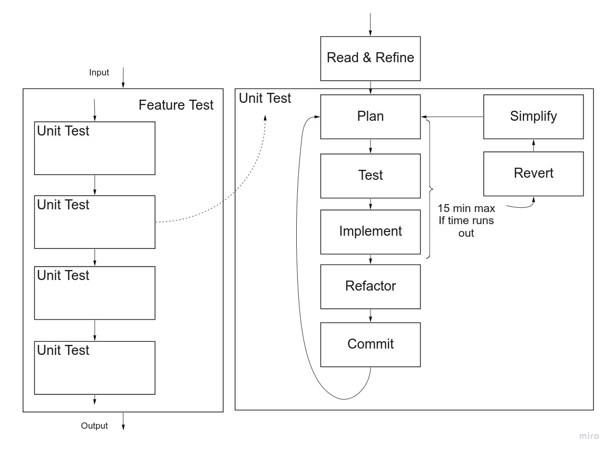

Previous to the tests, from the specifications or users stories, I read and refine entirely the requirements to get a general understanding of the user interactions. The big picture helps me to get an idea of the direction. Then make a quick drawing of the entire project so I can easily keep it in mind. If I find it necessary, I write or rewrite the users stories so that they have a more manageable size to work with. I then order the user stories and create a diagram of the classes, properties and functions needed for the first feature, this is the planning part. Finally, I start the process:

Red phase - Test

- 1- I translate the first user story into my first feature test.
- 2- I run the test to make sure my feature test fails.
- 3- I write the failing unit test matching the feature test.
- 4- I run the test to make sure my unit test and feature test fail for the same reason.

Green phase - Implement

- 5- I write the easiest code to make the unit test pass, no more.
- 6- I run the tests and check if unit test passes. If not, repeat step 5.
- 7- I repeat steps 5-6 until the feature test passes entirely.

Refactor phase - Refactor

- 8- I modify the code without adding any feature. I make sure all best practices are respected.
- 9- I run tests again to check that the refactoring did not break the tests.
- 10- I then start the loop again with a new user story.

When I commit, I add, commit and push to [Github](https://github.com), it helps to save the different versions of my work, working alone or in a group. I can also take more risks when I write code because I know a saved version of the working code exists. Here it is important to write meaningful and consistent message, so, anyone can find the relevant commit.

After 15 minutes working on writing some code to implement a test, it is good to step back and wonder if the test we are doing is the good one in term of what we are testing and of how much we are testing, this is why it is recommended that after 15 minutes we remove all our changes since our last commit , 'revert', and 'simplify' our test.

---

We can see how the 'Unit test' is defined by the 'Feature test error'. In the example taken earlier, the first error would be that we don't have a class Account.

````md
NameError:
     uninitialized constant Account
````

This is the moment to create a file for our unit test for our class 'Account': 'account_spec.rb'. Then, to answer this message error, we create an 'account.rb' file with:

````ruby
class Account

end
````

Because this test is very basic and simple, we tend to use it only to test the testing environment works and then to skip it. Also, the future test we will write will test this, and as we want to avoid redundant tests, we may delete previous tests in the refactor phase.

Keeping this example, we are going to receive an error message because we don't have a method called 'add_to_basket'. Here, '#<Account:0x000055f7f162a400>' is an object of the class Account.

````md
NoMethodError:
       undefined method `add_to_basket' for #<Account:0x000055f7f162a400>
````

We can write the Unit Test sending the same error message.

````ruby
 it 'answers to add_to_basket' do
    user_account = Account.new
    expect(user_account).to respond_to(:add_to_basket)
  end

````

And here we solve the unit test problem, then we move to the next one.

````ruby
class Account do
  def add_to_basket

  end
end
````

Then we are going to receive an error message because 'add_to_basket' should receive an argument from the Feature Test.

````md

ArgumentError:
       wrong number of arguments (given 1, expected 0)

````

So we will create a new Unit Test and solve it this way.

````ruby
class Account do
  def add_to_basket(item)

  end
end
````

Then we would keep going this way, I am not going to go further here. What is important is to understand the step by step approach so we always know what to do next. And if we do hesitate because we work with a new testing framework we can search online, and we know what we are looking for.

Trying to do small steps, we may be tempted to create unecessary test, for example, one usual mistake is to test State over Behavior. When I plan, I work on the scope of my test, making my test simple but meaningful.

The previous example was testing the Behavior because 'add' is the name of the method that will transform the 'basket'. However, the following test is a 'bad' one because it tests the State.

````ruby
  it 'basket to have an apple' do
    user_account = Account.new
    expect(user_account.basket).to include('apple')
  end
````

 To solve this test I could code the answer directly, and no transformation would happen, this is called to 'hardocde' the result. So, I am testing a State that I am writing, not a Behavior I am creating, this is why the latest test is unecessary. Below you can see how I would anwer to a wront test, not creating the behavior expected by the user, not moving forward.

````ruby
it 'adds an apple to the basket' do
  class Account
  attr_reader :basket
  def initialize
    @basket = ['apple']
  end
end
````

THis is why we say that our approach to Test Driven Development is **Behavior Driven Development**.

---

'I can Test Drive Develop anything' means that when I am facing a problem, I am able to divide it in small chunks, that I am able to be very clear about what I want to achieve in those chunks, that I develop my solution step by step, writing the test first and then finding the solution. It means that whatever language or project I am working on, I am able to consistently use a methodology such as the Red-Green-Refactor In other words, I can use a process to create structured code, easy to read, debug and update.

---

Here are few interesting examples. When we go further with testing we encounter those cases:

---

When a new class is created during a Unit Test, we create a fake, here is an example with Rspec:

````ruby

let(:plane) { Plane.new }

````

[Link to faking a plane object while solving Airport Challenge TDD](https://github.com/AdrienFabre/airport_challenge_ruby/blob/6a4b4bc5c3e53e515494e33da19f00478da84f63/spec/airport_spec.rb)

In the Airport Challenge, in the Airport class unit test, so we can use an instance of the class Plane, we create a double that we can access everywhere in this test. This is a good way to make the Unit Test independent, so we only test the Airport class with the Airport Unit Test. This mindset is valuable for every part of the test, we want to test only one thing at a time, so we know what is broken if the test beaks. While in the feature test, we want to test everything together like if a user was using it, so we would never see a fake (or double) in a Feature Test.

So, we were able to use a plane in our tests for the Airport class while it was not existing yet.

---
When we want to test what is output in the terminal, we use the following syntax:

````ruby
  it "prompts the user to say something with 'Say something:'" do 
      expect { Echo.prompt }.to output('Say something:').to_stdout
  end
````

[Link to testing the output in the terminal in the Echo Challenge TDD](https://github.com/AdrienFabre/echo_ruby/blob/0307b636c4e105de552e64d75b369bb57daec184/spec/echo_spec.rb)

This syntax enables us to create an expected output, that will not be returned at the end of the code, but displayed in the terminal.

---

When we want to test what is inputed in the termial, we use the following syntax:

````ruby
it 'receive the user answer' do
  allow(Echo).to receive(:gets).and_return('hello, world/n')
  expect(Echo.receive).to eq('hello, world')
end
````

[Link to testing the input in the terminal in the Echo Challenge TDD](https://github.com/AdrienFabre/echo_ruby/commit/48baaf4b5a212df450160a0ba9de9ec7bbeeb67a#diff-fb4dc7c0bd38dc2a980d90e370c3338a)

Here, this 'allow...' syntax enables to mimic the user input in that specific case because it is use on ':gets', however we can use it in many situation to fake the behavior of another class.

---

When we want to test a class that includes the time we need to fake it, in that case we can use:

````ruby
    time_now = Time.new(2019, 1, 2, 3, 4, 5, '+00:00')
    allow(Time).to receive(:now).and_return(time_now)

````

[Link to setting the time 'now' to a fixed time in the Echo Challenge TDD](https://github.com/AdrienFabre/echo_ruby/blob/master/spec/echo_spec.rb)

Here we are using the class Time and the method 'now' defined by Ruby, we are telling them to return a specific value, so we can test something that involves Time.

---

Here what is interesting, in the Rock Paper Scissors game, is that we are faking randomness.

````ruby
    it 'returns a shape' do
      allow(Kernel).to receive(:rand).and_return(1)
      expect(Computer.new.shape).to eq 'Paper'
    end
````

[Link to setting the 'randomness' to a fixed number in the RPS Challenge TDD](https://github.com/AdrienFabre/rps-challenge/blob/master/spec/computer_spec.rb)

Here we are using the class Kernel and the method 'rand' defined by Ruby, we are telling them to return a specific value, so we can test something that involves randomness. In this specific case, we want the computer player sent random shape and each shape will have a different outcome to the game, so we want to be in control of the shape so we can test each outcome.

---

When we want to do a Feature Test in a complete app, we don't want the user to use the terminal, but an interface through the browser, in that case we use Feature Tests mimicing the user interface in the browser. In this case we use [Capybara testing framework](https://github.com/teamcapybara/capybara) to test the [Sinatra](http://sinatrarb.com/) and Ruby environment.

````ruby
feature 'display the celebration message' do
  scenario 'display the number of days before birthday date' do
    visit("/")
    fill_in :name, with: "Erin"
    select '26', from: 'day'
    select 'Jan', from: 'month'
    click_button "Submit"
    expect(page).to have_content "Your birthday will be in 1 day!"
  end
end
````

[Link to a feature test with Capybara in the Birthday App Challenge TDD](https://github.com/AdrienFabre/birthday_app/blob/334a29bc2c364e30420e98666e2b1c8b56303592/spec/features/display_birthday_spec.rb)

Here the test is doing the job of testing for the sentence to be right, however, we could need to do more tests because may be our code to answer the test may be valid only if we have a birthday day date that is later in the year, or may be it works only during the current month. This is the moment where we need to write the edge cases tests, that enables us to enable different uses of the app. However, no every case is necessary and testing each edge case is a matter of prioritisation, what is the most important and what resource is availble. Edge cases are dealt with with the unit tests.

This feature test drived me to create those 2 unit tests that are testing the cases if it is my Birthday or if it is not.

````ruby
  it "return birthday if the date selected is today" do
    Time.stub(:now).and_return(Time.mktime(2019,1,25))
    day_selected = 25
    month_selected = 1
    expect(Calculator.new(day_selected,month_selected).time_left).to eq 'birthday'
  end

  it "return the number of days between now and the date selected" do
    Time.stub(:now).and_return(Time.mktime(2019,1,25))
    day_selected = 26
    month_selected = 1
    expect(Calculator.new(day_selected,month_selected).time_left).to eq 1
  end
````

[Link to a unit test with Rspec in the Birthday App Challenge TDD](https://github.com/AdrienFabre/birthday_app/blob/master/spec/Capybaracalculator_spec.rb)

---

Here is another example of the Airport Challenge, where I am using a new language, Javascript, and one of its [testing framework Jasmine](https://jasmine.github.io/2.0/introduction). Here I am creating a block, BeforeEach, that is going to happen before each test. In that case, I am creating a new Airport, the class I am testing. I am also creating a Plane, which is a way to create a fake Plane that is going to answer to the method 'land'.

````javascript

 beforeEach(function(){
    airport = new Airport();
    plane = jasmine.createSpy('plane',['land'])
  });

````

[Link to airport unit test with Jasmine in the Airport Challenge TDD](https://github.com/AdrienFabre/airport_challenge_js/blob/master/spec/AirportSpec.js)

---

In the Makers Final Project, we used [React](https://reactjs.org/), so Javascript, to Feature Test our app, we used [Cypress](https://www.cypress.io/).

````cypress
it("can create a new card", () => {
    cy.get('#plus').click()
    cy.get("input[name=title]").type('Test Card');
    cy.get("input[name=urgent]").click();
    cy.get("#Create").click()
    cy.contains('Test Card');
  })
````

[Link to feature test with Cypress in the project management app](https://github.com/what-zen/what-zen-app/blob/dev/cypress/integration/ourTests/Cards.spec.js)

Here we did not succeed to properly Test Drive our application, we did create feature test after we created our app. We would have needed a some more time to be confortable enough with Jest and Enzyme to Test Drive the entire application. This is where I found the limit of learning a new language and test drive at the same time. In that moment, spiking is a way to learn, otherwise it is hard to test something that we don't know about. With a bit more time, we could do everything again from scratch with TDD.

---

One of the advantage of TDD is that the test coverage is theoricaly 100%, with Ruby we used [Simplecov](https://github.com/colszowka/simplecov) to make sure it was.

---

Feedback I received:

Alice - Coach at Makers - After the training process review

"You ask less questions but a very good one 'could you give an example of user interaction?'"

"You process was good, you may need to believe in it more"

"You are testing behaviour first, which is really good to see."

Kai - Student at Makers - After the training process review

"You follow the process and persevere to follow the step by step approach"

Brooke - Student at Makers - After the training process review

"This is impressive. You don't use the cards because you know the process very well and you know what you are doing at each step."

Clare Pinder - Student at Makers - After the training process review

"Adrien set out a clear plan for program - to follow the 'criteria tests' as feature tests. Where the code was behaving unexpectedly,  he read the error message quickly to locate where the issue remained and he studied the code carefully and sought visibility by printing some choice lines to the console. He remained calm and only fixed the error when he knew the problem - he didn't 'shoot around in the dark'."

---

### I can program fluently

From my experiences with human languages, as a French that learnt English and Russian within the past 10 years, I would divide fluency in different parts.

The part that is similar among languages and that makes it easier to learn new languages such as the main logic, structures, rules, characters, environments all of this, even if it is not identical, it helps to understand and adapt in new language environment easily. Each part that is unique to a language can still differenciate what can be done and not be done, so, we can always draw parallels among languages even if they are very different.

Programming languages have those two parts too, learning Ruby was challenging because I did not have any reference from previous programming language. Once I understood the patterns, the big picture, the details, I acquired the key words to quickly search online whatever syntax was missing. Because I did not know the syntax but I knew what I was willing to use in term of logic or structure. This first programming language helped me to explore Javascript and a little bit of Java with their own differences and similarities. Then, learning the test framework language was another step, because the logic is different, however after RSpec, Jasmine was also easier.

Program fluency means that I have explored enough programming languages so that I am confident that I can use my acquired abilities to understand programming languages, to search efficiently and to learn quickly, and perform in a reasonable amount of time.

I can show few examples of different programming environments I adapted in the past.

[Link to my first project at Makers where I created docking station class for the Boris Bike Challenge](https://github.com/AdrienFabre/boris_bikes-1/blob/master/lib/docking_station.rb)

[Link to the commits to my process review Echo Challenge](https://github.com/AdrienFabre/boris_bikes-1/blob/master/lib/docking_station.rb)

The important part is that between those 2 projects, while the language and the testing framework are identical, my understanding of coding and of the entire process evolved a lot. The fluency is shown by how I was able to solve the Echo challenge that requires different techniques to implement each features. So, programming fluently is about learning how to learn as well as understanding the basics of how to understand client request, testing and coding.

[Link to a version of a minimalist Facebook created with Ruby on Rails in a group](https://github.com/simian-sinister/Acebook-Simian-Sinister)

[Link to a version of a minimalist AirBnb created with React and Node in a group](https://github.com/AdrienFabre/makersbnb)

[Link to a version of a minimalist Trello created with React and FireBase in a group](https://github.com/what-zen/what-zen-app)

The other side of progamming fluently, is the ability to translate human language such as specification or user stories into code and to write code using the best practices such as Test Driven Development, Don’t Repeat Yourself, and Single Responsibility. In other words, keep in mind the person that may use your user interface as a user and your code as a software developer.

I found that my various expriences in term of jobs as well as facilitation of design thinking workshops helped me to keep those 2 types of person in mind.

As an example, during Makers, facing over 30 challenges with different sizes, shapes and requirements in different languages, I learned how to approach programming challenges, this why I could say that I can programme fluently.

---

Feedback I received

Krzysztof Balejko - Student at Makers

"I’ve found his code to be of very good quality therefore I had no problem in understanding the logic behind his code base."

Brooke - Student at Makers - After the training process review

"This is impressive. You don't use the cards because you know the process very well and you know what you are doing at each step."

Diptis Hadler - Student at Makers - Collaborated on the final project

"It was clear that he can code fluently as soon after we settled on the technology stack we would use he did a large part of the code to reach our MVP. He then built on that and improved features, especially on the look and feel of the front-end, showing his skill in refactoring the initial deliverables."


---

### I can debug anything

A bug is an unexpected behavior. Debugging is about finding why this behavior occurs and modifying it so it matches our expectations.

Being able to debug anything is about having a clear process to find the source of a bug, a process that can be used in any language. This process is divided in two main parts.

'Getting visibility', finding ways to follow the flow and to display the information created along the flow, then 'Tighten the loop', narrow down so we can find out at which moment the unexpected behavior occurs. Each environment has different syntax to make it happen but the process is similar in those environments.

The first example would be the error message I shown in the TDD part, when the error message shows, this is a bug, but because we define a precise test, the bug is already clear, we already have the visibility and the loop thightened, so we know how to move forward. So, the first way to get some information about the bug is to run the test. (if we are lucky enough to have tests in the test we are debugging)

Bug are in lot of places and even without a test, I learned that one of the main skill is to be able to read the error message. For example, the bug could be during the setup and we are not able to get much visibility from places we don't control. For example:

I downloaded a repository online and when I run 'rspec' to see the test I receive the following message:

````bash
adrien@adrien-XPS-13-9360:~/Projects/instagram-challenge$ rpsec
Command 'rpsec' not found, did you mean:

  command 'rspec' from deb ruby-rspec-core
  command 'ipsec' from deb strongswan-starter
  command 'ipsec' from deb libreswane
````

Here this is clear and helpful, my error is the way I spelled 'rspec' and also I am getting relevant suggestions. So, I write it the correct way.

Then I get:

````bash
adrien@adrien-XPS-13-9360:~/Projects/instagram-challenge$ rspec
Could not find concurrent-ruby-1.1.4 in any of the sources
Run `bundle install` to install missing gems.
````

Here as well I am getting a clear and helpful message. So, I tape 'bundle install'.

Then, while the gems are installing, I get a long line of errors containing this line:

````bash
Gem::Ext::BuildError: ERROR: Failed to build gem native extension.
````

and this line:

````bash
checking for pg_config... no
````

after some research online, I find out that this error often occurs on Windows or Ubuntu (my situation) because a package is missing and that running the following line will solve it:

````bash
sudo apt-get install libpq-dev
````

Then, I run it, I run 'bundle install' and it works. So I try to run 'rspec' again, but now the error is:

````bash
An error occurred while loading ./spec/features/welcome_page_spec.rb.
Failure/Error: ActiveRecord::Migration.maintain_test_schema!

PG::ConnectionBad:
  could not connect to server: No such file or directory
        Is the server running locally and accepting
        connections on Unix domain socket "/var/run/postgresql/.s.PGSQL.5432"?
````

From the first few lines I can see that the problem is because I did not create the database locally. After some research online. (indeed I searched online because I did not write a proper README in the repository I downloaded). I ran:

````bash
adrien@adrien-XPS-13-9360:~/Projects/instagram-challenge$ rake db:create
FATAL:  role "adrien" does not exist
Couldn't create 'instagram_development' database. Please check your configuration.
rake aborted!
ActiveRecord::NoDatabaseError: FATAL:  role "adrien" does not exist
````

So, I encountered a new problem, I went to search online again. I ran:

````bash
adrien@adrien-XPS-13-9360:~/Projects/instagram-challenge$ sudo -i -u postgres
````

then:

````bash
postgres@adrien-XPS-13-9360:~$ psql -d postgres
````

then:

````bash
postgres=# CREATE ROLE adrien;
````

and the role adrien was created. Then I faced a new problem:

````bash
adrien@adrien-XPS-13-9360:~/Projects/instagram-challenge$ rake db:create
FATAL:  role "adrien" is not permitted to log in
Couldn't create 'instagram_development' database. Please check your configuration.
rake aborted!
PG::ConnectionBad: FATAL:  role "adrien" is not permitted to log in
````

So, I searched online how to authorise of this new role. I entered:

````bash
postgres=# ALTER ROLE adrien WITH LOGIN;
````

and finally, I have got:

````bash
adrien@adrien-XPS-13-9360:~/Projects/instagram-challenge$ rake db:create
Created database 'instagram_development'
Created database 'instagram_test'
````

What is important here is that this is the debbugging part related to the setup, this is also this one that is hard because we do not get the visibility from inside the code. This is where the skill to read the right line, to make the right assumption, to ask the right question and to take the right information, then doing the right action, customised to the situation is the key to move forward.

Now, if I try to do 'rspec':

````bash
Migrations are pending. To resolve this issue, run:
        bin/rails db:migrate RAILS_ENV=test
````

It is good because it is telling be exactly what to do, however I am getting another error:

````bash
adrien@adrien-XPS-13-9360:~/Projects/instagram-challenge$ bin/rails db:migrate RAILS_ENV=test
bash: bin/rails: Permission denied
````

After some more online search I tape:

````bash
adrien@adrien-XPS-13-9360:~/Projects/instagram-challenge$ chmod u+x bin/rails
adrien@adrien-XPS-13-9360:~/Projects/instagram-challenge$ bin/rails db:migrate RAILS_ENV=test
== 20190303110850 DeviseCreateUsers: migrating ================================
-- create_table(:users)
   -> 0.0161s
   ...
````

And finally it works.

````bash
adrien@adrien-XPS-13-9360:~/Projects/instagram-challenge$ rspec
...

Finished in 0.30878 seconds (files took 1.15 seconds to load)
3 examples, 0 failures
````

This is how, in a new environment (Linux Ubuntu 18.04), I start to use my debugging skills before writting any code. This is actually a skill that I built through Makers and that slowed me down more than expected during weekend challenges.

---

Now that we are setup with a working small Ruby on Rails program with a database I can modify the test and get a 'bug' from a feature test.

````bash
adrien@adrien-XPS-13-9360:~/Projects/instagram-challenge$ rspec
F..

Failures:

  1) Sign in Can sign in from the welcome page
     Failure/Error: expect(page).to have_content("Welcome to instag!")
       expected to find text "Welcome to instag!" in "Toggle navigation Insta!\nSign up Sign in\nWelcome to insta!\n“Photography is the story I fail to put into words.” — Destin Sparks"
     # ./spec/features/user_sign_in_spec.rb:7:in `block (2 levels) in <top (required)>'

Finished in 0.18407 seconds (files took 1.2 seconds to load)
3 examples, 1 failure

Failed examples:

rspec ./spec/features/user_sign_in_spec.rb:4 # Sign in Can sign in from the welcome page
````

Here what is very important is that I get the error message telling me to have a look at the file user_sign_in_spec.rb:7, which means line 7, this is where the test is failing. (the line 4, from the second green line is indicating the beginning of this test).

This is a very precise and precious indication. I can also see what is not working: 'expected to find text "Welcome to instag!" in "Toggle navigation Insta!\nSign up Sign in\nWelcome to insta!...'

Here we can already see that the problem is that what exist does not match the expectation, we can see that I made a mistake in my test, I wanted to write "Welcome to insta!" and not "Welcome to instag!", this is one bug fixed.

Or, as I can see on my test that the page tested is "/", I could just change the text from the view file that matches the "/" route. Usually, this is the test that is right and the mistake is in the code.

---

This is a Ruby on Rails environment. So I can run 'rails s' and get visibility from the browser on the given address, here it is 'http://localhost:3000/'.

In the terminal, when I do 'rails s' I can see details of what is happening when I click in the browser, this is also a way to get visibility. For example when I try to 'Sign in' with an Unauthorized account is says:

````bash
Started POST "/users/sign_in" for 127.0.0.1 at 2019-04-03 16:58:48 +0100
Processing by Devise::SessionsController#create as HTML
  Parameters: {"utf8"=>"✓", "authenticity_token"=>"OVFYvABljkPEaR9f5zgyXwmUkHlc1jcbsfXzEaqqqomNI2Bc9G3HBCifnqwG3hQllUTTUcOyVZLUBbtEpPlQsQ==", "user"=>{"email"=>"adrien.fabre.1@gmail.com", "password"=>"[FILTERED]", "remember_me"=>"0"}, "commit"=>"Log in"}
  User Load (0.7ms)  SELECT  "users".* FROM "users" WHERE "users"."email" = $1 ORDER BY "users"."id" ASC LIMIT $2  [["email", "adrien.fabre.1@gmail.com"], ["LIMIT", 1]]
  ↳ /home/adrien/.rvm/gems/ruby-2.6.0/gems/activerecord-5.2.2/lib/active_record/log_subscriber.rb:98
Completed 401 Unauthorized in 5ms (ActiveRecord: 0.7ms)
````

I can clearly see what is sent to the database and the result: '401 Unauthosized'. When I click on 'Sign up' I get:

````bash
Started GET "/users/sign_in" for 127.0.0.1 at 2019-04-03 17:20:32 +0100
Processing by Devise::SessionsController#new as HTML
  Rendering devise/sessions/new.html.erb within layouts/application
  Rendered devise/shared/_links.html.erb (1.3ms)
  Rendered devise/sessions/new.html.erb within layouts/application (5.6ms)
Completed 200 OK in 32ms (Views: 29.7ms | ActiveRecord: 0.0ms)
````

I can see devise (what is taking care of the identification in Ruby on Rails), being responsible for registering the user, I can see that the password is not displayed and I can see '200 OK' that tells me that it worked, the form is rendered. Then, when I 'Sign up' it says:

````bash
Started POST "/users" for 127.0.0.1 at 2019-04-03 16:59:07 +0100
Processing by Devise::RegistrationsController#create as HTML
  Parameters: {"utf8"=>"✓", "authenticity_token"=>"u9UMHWPhW+GMcgsxYMmPQQ5kEiYEVWxY/b2GuufjL0f9UA27a8MgUVaoOQL97f/UOWW50gDRfDx0zntlwR7maQ==", "user"=>{"user_name"=>"Adrien", "email"=>"adrien.fabre.1@gmail.com", "password"=>"[FILTERED]", "password_confirmation"=>"[FILTERED]"}, "commit"=>"Sign up"}
Unpermitted parameter: :password_confirmation
   (0.2ms)  BEGIN
  ↳ /home/adrien/.rvm/gems/ruby-2.6.0/gems/activerecord-5.2.2/lib/active_record/log_subscriber.rb:98
  User Exists (0.4ms)  SELECT  1 AS one FROM "users" WHERE "users"."email" = $1 LIMIT $2  [["email", "adrien.fabre.1@gmail.com"], ["LIMIT", 1]]
  ↳ /home/adrien/.rvm/gems/ruby-2.6.0/gems/activerecord-5.2.2/lib/active_record/log_subscriber.rb:98
  User Create (1.1ms)  INSERT INTO "users" ("user_name", "email", "encrypted_password", "created_at", "updated_at") VALUES ($1, $2, $3, $4, $5) RETURNING "id"  [["user_name", "Adrien"], ["email", "adrien.fabre.1@gmail.com"], ["encrypted_password", "$2a$11$DOfRRtjJJlKVJ7NP.IOHKO28dN8wZbQdqXOZBgmMZZ2wnTIvY4jcG"], ["created_at", "2019-04-03 15:59:07.382565"], ["updated_at", "2019-04-03 15:59:07.382565"]]
  ↳ /home/adrien/.rvm/gems/ruby-2.6.0/gems/activerecord-5.2.2/lib/active_record/log_subscriber.rb:98
   (3.1ms)  COMMIT
  ↳ /home/adrien/.rvm/gems/ruby-2.6.0/gems/activerecord-5.2.2/lib/active_record/log_subscriber.rb:98
Redirected to http://localhost:3000/
Completed 302 Found in 162ms (ActiveRecord: 4.9ms)
````

Devise use Active Record to connect to the database and create my login data, so it returns:'302 Found', saying that it is working. Also I see that the password is encrypted.

Here I see all the information being created, for example those which are saved into the database. In that specific case we are using [Devise as an identification solution](https://github.com/plataformatec/devise), so we don't manage everything. I can also see what is created in the database using [TablePlus](https://tableplus.io/) or [Postman](https://www.getpostman.com/).

Here is the end of this example with Ruby on Rails.
[Link to the test of the repo used from the Instagram Challenge](https://github.com/AdrienFabre/instagram-challenge/blob/master/spec/features/welcome_page_spec.rb)

---

Here we can see an example with javascript and the Airport Challenge.
[Link to the tests from the Airport Challenge in Javascript](https://github.com/AdrienFabre/airport_challenge_js/tree/master/spec)

Here the testing framework is Jasmine, so we don't get the visibility from the tests in the terminal but we get it from openning 'SpecRunner.html'.

When everything is working the tests look like this in the browser.

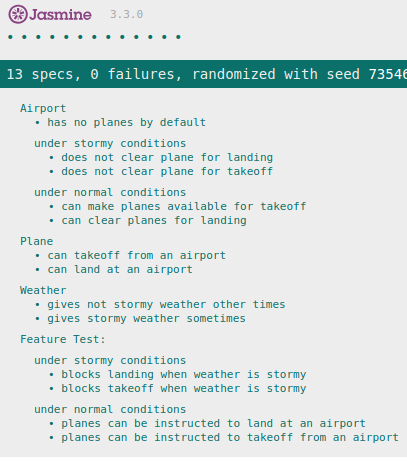

When I create an error I can see:

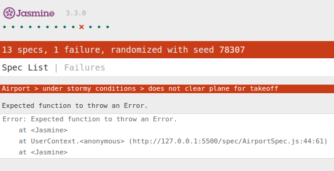

Here we can see 2 information, first, the expectation 'throw an Error', second, a file(AirportSpec.js), a line(44) and a number of character(61) to look at.

Another thing interesting to notice is that if I refresh the page I get different errors. This means that the errors varies, so I can already think about our programme, that the is a random weather,  and that may be the cause of the variation in the errors.

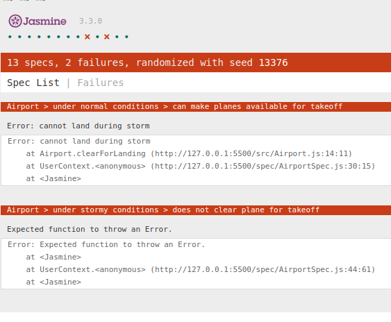

If I go to look where is my first error is, I can see that it targets in the file AirportSpec.js:

````Javascript
it('does not clear plane for takeoff', function(){
      expect(function(){ airport.clearForTakeOff(plane); }).toThrowError('cannot takeoff during storm');
});
````

 Now, I can go to the file Airport.js and see where is the method '.clearForTakeOff(plane)' that is expected to ".toThrowError('cannot takeoff during storm')". And I can see:

````Javascript
if(this._weather.isStormy())
    throw new Error('cannot takeoff during storm');
}
````

What I am seeing is that the result of 'this._weather.isStormy()' defines if the Error will be thrown or not. So, I can get visibility on what is its result by doing console.log(this._weather.isStormy()) just before it. I can go to the file SpecRunner.html in the browser, right click and inspect the page, then I go to see what is happening in the console.

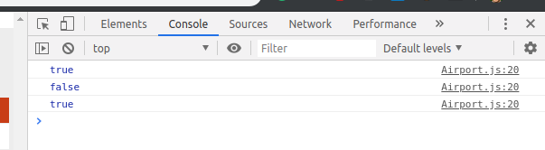

Here what I can see is that the result varies among the tests.

Now, I can have a at what is this._weather, the 'this' means that is it one of the variable from the Airport object. So, I go to see where this variable is created:

````Javascript
function Airport(wether){
  this._weather = typeof weather !== 'undefined' ? weather : new Weather();
  this._hangar = [];
}
````

Here I can see that there is spelling mistake, 'wether', should be 'weather', so I can correct it and see that I do not have anymore errors. However, if I want to really understand, I wonder, what is hapenning here? If the 'weather' argument is 'undefined' we get 'new Weater()', a new instance of the class Weather. So, in our case, a new instance of the class 'Weather' is created each time we are creating a new instance of 'Airport'. With the spelling mistatke, it means that the argument we are passing does not count.

Now, as all error messages come from the file AirportSpec.js,let's see how we get the weather into this file.

````Javascript
beforeEach(function(){
  weather = jasmine.createSpyObj('weather',['isStormy']);
  plane = jasmine.createSpy('plane');
  airport = new Airport(weather);
});
````

Here we can see that in the file AirportSpec.js, we create a Spy Object of 'Weather' that can answer to the method 'isStormy', then we pass is as an argument into the object 'Airport'. However, because the argument of the new Airport is never read because of the spelling mistake, our Spy is never really used. So when we do:

````Javascript
beforeEach(function(){
  weather.isStormy.and.returnValue(false);
});
````

The weather we define in our test is created but not used by the airport we are using. So, we do not control the result of our 'isStormy' method and this is why our result varies.

[Link to the AirportSpec.js file on Airport Challenge JS](https://github.com/AdrienFabre/airport_challenge_js/blob/master/spec/AirportSpec.js)

---

In several cases I faced errors where the expected behavior is not what I want and there is no error messages, so, I have to find by myself the information flow that creates this unwanted behavior. The examples shown are representative of the bugs I regularly faced but not extensive. With some time, debugging became natural and I did not notice it.

I can debug anything means that I am able to understand what is the expected behavior, to notice that the expected behavior it not fulfilled and then I am able to make a clear assumption about why this unexpected error occurs and then find ways to verify this assumption. Then, step by step, througt research and following the flow of the error, I finally solve the error message. Meaning that with enough time, I have developed the right process to debug anything. One step at a time.

---

A bug could be other things too, for example, on our deployed website What Zen, the cards coming from the database take time to appear, this is unconvenient for any user, we could consider it like a bug.

Also when we are logged in, when we go to the website and click on the button 'What Zen' to go to 'https://what-zen-app.firebaseapp.com/home' it works. But if we refresh the exact same page, we get '404
Page Not Found'.

Finally, when we go to the deployed website and go to 'inspect' and 'console' we can see the warning message:

````md
It looks like you're using the development build of the Firebase JS SDK.
When deploying Firebase apps to production, it is advisable to only import
the individual SDK components you intend to use.

For the CDN builds, these are available in the following manner
(replace <PACKAGE> with the name of a component - i.e. auth, database, etc):

https://www.gstatic.com/firebasejs/5.0.0/firebase-<PACKAGE>.js
````

Each of those 'bugs' could be sorted, the only reason it is not is the amount of time I would have to dedicate to sort them. The more I debug, the faster I am to debug because I have seen multiple problems and multiple version of different problems in different languages, however the identification of the real problem and the research of solution that exist are a big part of debugging and as we constantly practiced TDD in our processes at Makers, debugging is a part of my daily practice.

[Link to the deployed What Zen website](https://what-zen-app.firebaseapp.com/)

[Link to the What Zen repository on Git](https://github.com/what-zen/what-zen-app)

---
Feedback I recieved.

Krzysztof Balejko - Student at Makers

"I have worked with Adrien on several occasions, during our pair programming sessions he has proven to be very good at debugging, championing the process of tightening the loop and getting visibility."

Clare Pinder - Student at Makers - After the training process review

"Adrien set out a clear plan for program - to follow the 'criteria tests' as feature tests. Where the code was behaving unexpectedly,  he read the error message quickly to locate where the issue remained and he studied the code carefully and sought visibility by printing some choice lines to the console. He remained calm and only fixed the error when he knew the problem - he didn't 'shoot around in the dark'."

---

### I can model anything

Model something is about taking something abstract and transforming in something tangible.

In our situations as software developers, we can model different things, often we are transforming specification and user stories into a few squares and arrows, that develops our understanding of the big picture and help us to define each part and how they fits together.

We can also model how technologies work together, we can create user stories from our intentions, we can create a model of what the user interaction would be, a model of how we organised the files of an app or just model to explain the logic behind a method, such as a list of conditional statements.

Here, I am defining user stories from our collective intention during the final project:

[Link to the What Zen readme with User Stories](https://github.com/what-zen/what-zen-app)

Then once this is created, we discussed the technology we are going to use, and one model helped to understand how pieces fit together, this model was found online [here](https://www.mongodb.com/blog/post/the-modern-application-stack-part-1-introducing-the-mean-stack).


This contributed to the collective decision to move towards less new technologies, using React as the Front End (Client Machine) and [Firebase](https://firebase.google.com/) for the whole Back End and the DataBase.

Then I drew a first wireframe, we started on a white board together and recorded digitally the most important part:

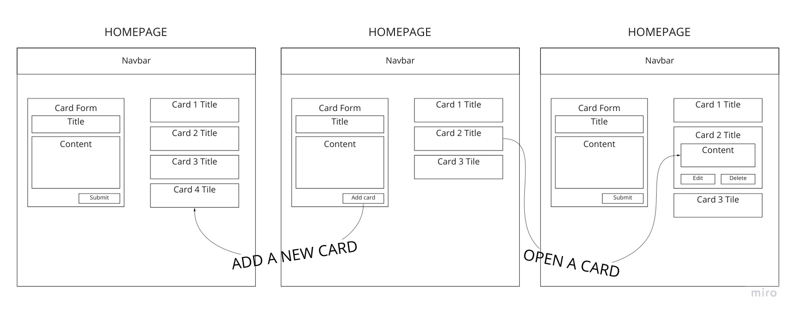

Then we updated it when our knowledge increased and the project advanced:

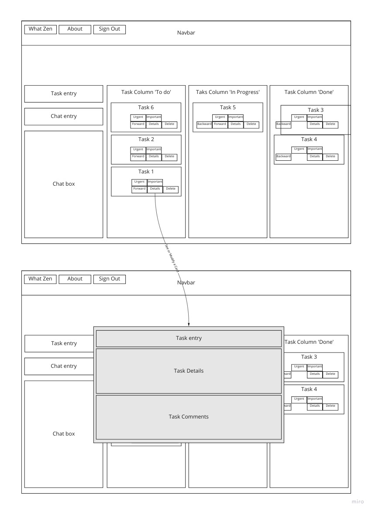

What is important here is to understand that a model is a way to put thoughts into shape. Also it helps to maintain a clear and a common understanding. For example, we created a file tree to understand how the different React component are interacting with each other:

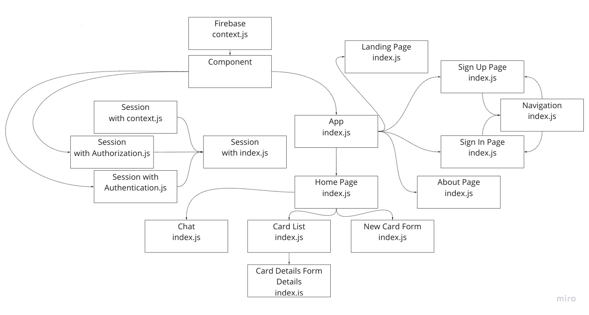

---

On another project, we receive the challenge to create a bowling scorecard. I started to translate requirements into user stories and then into tests:

[Link to tests on Scorecard Bowling Challenge in Javascript](https://github.com/AdrienFabre/bowling-challenge/blob/master/spec/scorecardSpec.js)

And I created the potential wireframe, the idea is always to see what the ideal solution would look like, so we know the direction:

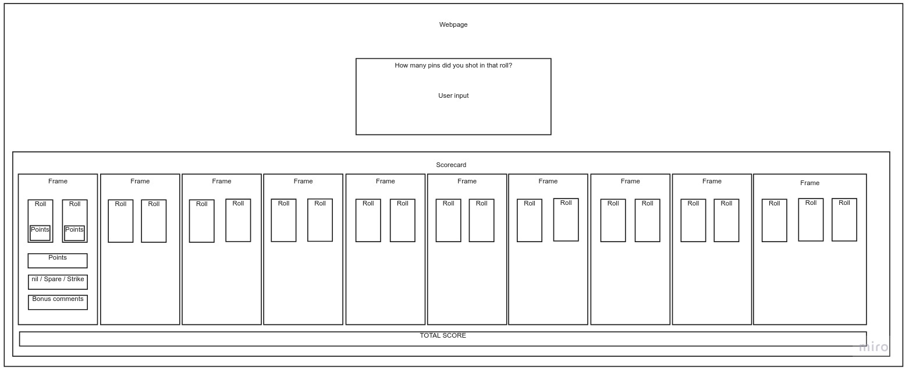

But this only one part of the modeling, the other part is more precise and focuses on how the data shape and movements.

Such as the diagram on this README file that reprensents the first user story with the interaction among the Client, the Controller, the Model and the View:

[Link to the Bookmark manager README file and its diagram](https://github.com/AdrienFabre/bookmark_manager)

I personaly really like to diagram as it really helps my understanding of things, for example, here the understanding of MVC:

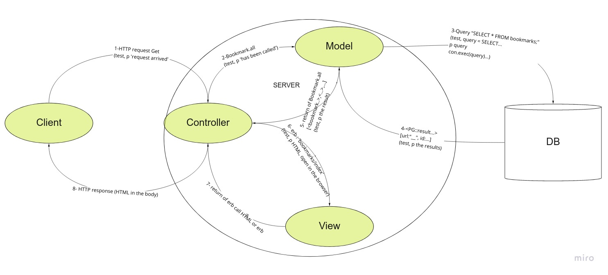

For most of those diagram I used [RealTimeBoard (or its new name Miro)](https://realtimeboard.com)

Also, I found that a small diagram with a pen and paper, deciding on what will be a class, what will be a method and what will be an argument helps to create a test and to make sense of the entirety of the project. Those small diagrams enable me to have the logic on paper and to avoid to re-understand the entire flow each time.

Then, taking time to identify the type of data between each block helps to understand it deeply, as my projects were quite small, I did succeed to get a good understanding of flows without every diagram detailled however I can see the benefit of it in bigger projects. Where I could do a diagram per feature created, so each of my commit on Github would have a diagram relevant to the current state of the implemented features.

At Makers, we used Unified Modeling Language, or UML, to model the relationship among CEO, COO and HR manager, what was very valuable is the broad common understanding of this kind of diagram. Here I used a similar approach to model the Bank Tech Test

[Link to Bank tech test README](Bhttps://github.com/AdrienFabre/bank_tech_test_ruby)

and created the following diagram:

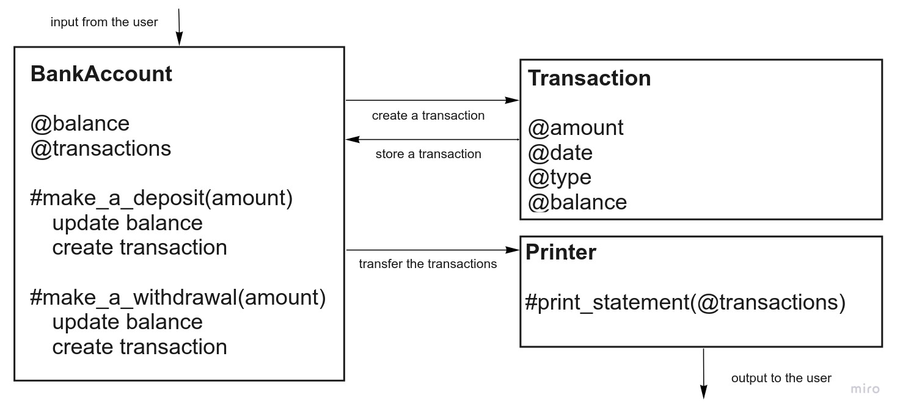
the
This diagram shows the different interactions among classes that could represent the solution of the Bank Challenge, this is independent to the language, as soon as the language is Object Oriented Programmed we can use it, like Ruby or Javascript.

I can model anything means that I am able to understand abstract concepts and to create words, shapes and interaction that may help personal and collective understanding of what exists or of what is planned to be created.

When I was studying electronics, I focused on the outcome I wanted under specific circumstances. For example if a user was pushing a button a train should go at a specific speed. The electricity was transformed in a way so that each element was aligned to produce this specific speed and a numerous number of logic gates could be necessary to achieve this. To be clear and experiment each possibility, we drew the whole schema and we were able to define the exact number of required gates.

---

Feedback I recieved

Krzysztof Balejko - Student at Makers

"Adrien starts each of his projects with careful planing and I was invited to join in before both bowling and front-end API challenges. During the process Adrien has demonstrated his abilities of modelling user interaction. We have used Realtime Board during both sessions for diagraming and general brainstorming. I would very happily work with him again!"

Kwaku - Student at Makers

"I saw Adrien very easily diagram the shape of our Acebook challenge using RealTimeBoard, a tool that he used in the past but he improved his skills using it to draw accurate diagrams."

Clare - Student at Makers - After a process review session

"During the process review, I have seen Adrien making a very simple diagram but meaningful before he started to write the tests."

Diptis Hadler - Student at Makers - Collaborated on the final project

"In some planning sessions he showed his skills in abstracting and modelling our proposed solution in diagrams. Again this helped us all to visualise our product as a team and progress towards solutions."

Dan Groze - Student at Makers - Collaborated on the final project

"I like that you always start tackling a problem with lots of planning, you are a master at diagramming and modelling. This helped all our team during our final project to understand our task better."

---

### I can refactor anything

Refactoring, this is modifying the code so it is better in different ways but the input and output stay the same. Basically this is doing the same thing in a better way. This is about knowing what is good and bad and where the compromises should be made.

For example the best is to have a code that is easy to read and also short, but the fact that we keep it short does not mean that we allow ourselves to be misunderstood for the sake of being short.

Then there are some best practices, an Object is usually a noun, a method is usually a verb and both of them should be coherent and be understood by any software developer that is going to read your code. To choose those nouns and verbs we usually use those from requirements and user stories. During the refactoring, we can verify that we are using the most relevant words.

If we take the example of the Bank test, here is the first line of the acceptance criteria:

````md
Given a client makes a deposit of 1000 on 10-01-2012
````

Here we can see the verb 'make a deposit', the nouns like 'amount', 'date', 'transaction', 'bank account', 'client' may be familiar to anyone reading this this line, then different design are possibles.

[Link to the Bank test in Ruby commits](https://github.com/AdrienFabre/bank_tech_test_ruby/commits/master)

Here you can see several commits with few having the word 'refactor' inside. Some of the refactoring may come from messages coming from a linter, in that case [Rubocop](https://github.com/rubocop-hq/rubocop), it will check that I am respecting the best practices of this language. Or I may get some external information from the badges I integrated in my readme, if [Travis](https://travis-ci.org/) is passing, if the coverage is 100% with [Coveralls](https://coveralls.io) and if the maintainability is A with [Codeclimate](https://codeclimate.com), those are usually signs that the code has been refactored.

However there are choices that are made that are less obvious. For example for the Bank test, I limit the size of the Printer methods by separating them, making sure each method respect the Single Responsibility Principle and stays DRY (Do not Repeat Yourself).

````ruby
class Printer
  def print_statement(transactions)
    transactions.reverse.map.with_index do |transaction, index|
      print 'date || credit || debit || balance' if index.zero?
      print "\n#{format_transaction(transaction)}"
    end
  end

  private

  def format_transaction(transaction)
    date = format_date(transaction.date)
    amount = format_amount(transaction.amount)
    balance = format_amount(transaction.balance)
    if transaction.type == 'credit'
      "#{date} || #{amount} || || #{balance}"
    else
      "#{date} || || #{amount} || #{balance}"
    end
  end

  def format_date(date)
    Date.parse(date).strftime('%d/%m/%Y')
  end

  def format_amount(amount)
    format('%.2f', amount)
  end
end
````

May be someone else would find a better way to do it. Here I made every method that is going to be used only internally, private. Private means that nobody has access to it outside of the classe, so there is no point to test it, in this case, it only helps the 'print_statement' method to be shorter and easier to read.

Here, on another repository, we can see that refacoring enabled me to remove lines of code and tests: [Link to commits of the Echo challenge](https://github.com/AdrienFabre/echo_ruby/commits/master)

Here as well, [Link to commits of the 10 minutes walk challenge](https://github.com/AdrienFabre/10_min_walk_ruby/commits/master)

The same way in other languages, here in React, we created several components, it helped us not to repeat ourselves.

[Link to the list of components of MakersBnB in React](https://github.com/AdrienFabre/makersbnb/tree/master/client/src/components)

---
Feedback I received

---

### I have a methodical approach to solving problems

Methodical approach to solving problems is what we are learning all along at Makers. In other words this is about knowing what to do next. In the [blog about problem solving from Sam Morgan](https://blog.makersacademy.com/how-i-solve-problems-a6a84d167598).

He describes the idea to solve a problem Systematically and Systemically. It took me some time to really understand it but now it is clear to me.

I would say that the first is about knowing what to do next because we have process and the second is about knowing what to do next because we have a direction.

This is what I used naturally in the previous description of my processes and how I implemented them. I see all those processes we learnt as cycles. For example we have processes to solve a very small problem like implementing a test or it could be creating an entire app with a team an implementing the agile processes.

This is also about constant prioritisation and knowing how the different processes we have learned need to be used and how they fit together. Here is a way to connect them, every cycle having a different timescale.

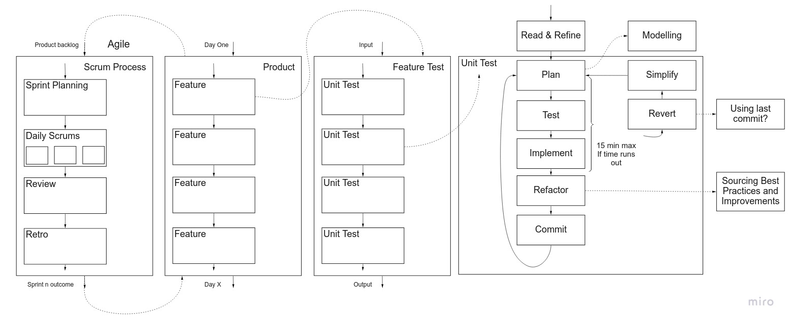

---

Feedback I received

Diptis Hadler - Student at Makers - Collaborated on the final project

"His approach to creating new software is very methodical and while we did not do as much formal TDD in this project as we had hoped we were nonetheless working in a very logical way together, and Adrien can take a lot of credit in keeping the team aligned in that way."

---

## I help my teams succeed

---

### I use an Agile product development process

As I learnt and practiced design thinking workshop facilitation before I really enjoyed learning and practicing Agile values and Scrum methods along my Acebook and final project What Zen, I spent time to understand it and shared my knowledge with the groups.

I have done it through the white board and through the Wiki:

[Agile: Scrum process 2 days sprint Wiki from our Acebook challenge](https://github.com/simian-sinister/Acebook-Simian-Sinister/wiki/Agile-Processes:-Scrum)

As well as during our final project presentation, I highlighted the Agile Values focusing on eXtreme Programming: communication, Simplicity, Feedback, Courage and Respect.

The way I embodied this is to make sure that everyday we had a session in front of the whiteboard where we remembered the collective goal and why we were going in that direction. Also, creating space for everyone to be heard, those stepping forward as much as those who were ok with any direction.

I also summarised our 4 cycles with different focused:
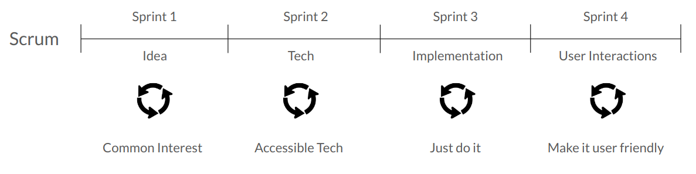

---

Feedback I received:

Luca Fruzza - Student at Makers - Collaboration on Acebook

"Adrien was very enthusiastic and helped the whole team to really understand it the second week of the Acebook challenge, while the first scrum process was jeopardize by our learning of Ruby on Rails."

Elliot Jennings - Student at Makers - Collaboration on Acebook

Before working on Jungl-Book with Adrien I thought I had grasped the concept of agile development. It was the guidance of Adrien during this project which allowed our team to now say we are confident with the framework. He gave us workshops on the scrum process and was devoted to making us stick to the following agile development in our second week. He is driven to manage a project and it seems to be a natural position for him as he always focuses on the bigger picture even when the team are being slightly short-sighted.

Diptis Hadler - Student at Makers - Collaborated on the final project

"I was in Team What Zen with Adrien for our final project. I was very impressed with Adrien's contributions in all aspects to the project.

In general he led the ideation and planning sessions that we had, writing notes and diagrams on the whiteboard to capture the salient points from the discussions we were having as a team. This helped us to focus on the key issues and explore ideas more effectively. I particularly liked the way he would ensure that the voice of everyone in the team was heard so that the any decisions the team would make would be achieved through consensus. This aligned well with the goal of our What Zen product."

---

### I write code that is easy to change

Writing a code easy to change means that each noun and verb, class and method names are choosing carefully so the understanding of the project is easy. TDD is a way to help to produce a code easy to change. Refactoring is a moment to specifically be careful at how easy the code is to be changed. Also, a good documentation, starting with an accessible README and a few diagram greatly help a software developer in front of a new code.

What helps is to get insights and input from general best practices and linters. Then to correct every part of the code so we make sure the collective understand of what is good is applied. Another way to guarantee this is to have our own code reviewed so we get feedback, also review someone else code, so we can understand what is not helpful to understand the code.

Another main point is to make sure we manage dependencies in our code, meaning that if one part of the code changes, the rest still works.

Here is an example:

````ruby
def initialize(transaction_class = Transaction)
  @balance = 0
  @transactions = []
  @transaction_class = transaction_class
end
  ````

This code is inside the class BankAccount and Transaction is also a class. Here what we see is a dependency injection, it means that the class Transaction is injected in the class BankAccount throught an argument, so, this is optional, we can replace it with something else. However, if there is no argument the class Transaction is going to be used and I can use it in other methods like here:

````ruby
def make_a_deposit(amount, date = Date.today.strftime('%d-%m-%Y'))
  @balance += amount
  @transactions << @transaction_class.new(@balance, amount, 'credit', date)
end
````

Here we can also see that I enable people to enter their own date by putting it as an argument of the method 'make_a_deposit', this is the same idea. Here we can see that I create a new transaction when I 'make_a_deposit' with '@transaction_class.new', which makes sense.

[Link to this class on the Bank test in Ruby](https://github.com/AdrienFabre/bank_tech_test_ruby/blob/master/lib/bank_account.rb)

---

With another context, with the Airport in Javascript, we can see that we are getting a new Weather for a new Airport, so we get:

````javascript
function Airport(weather){
  this._weather = typeof weather !== 'undefined' ? weather : new Weather();
  this._hangar = [];
}
````

[Link to the Airport repository in Javascript](https://github.com/AdrienFabre/airport_challenge_js/blob/master/src/Airport.js)

We can consider all of it as a part of the best practices that we implement at each refactor, part of the TDD process. It could be also customised to what have been decided as a best practice for the project as a group, notably during the SCRUM ceremonies.

---

Feedback I received

Krzysztof Balejko - Student at Makers

"I’ve fond his code to be of very good quality therefore I had no problem in understanding the logic behind his code base."

William Dunk - Student at Makers - Collaborated on the MakersBnB project

"Adrien quickly demonstrated a strong ability to style webpages using CSS and the styled components library for React. Styling instructions were clearly and logically laid out, allowing changes to be rapidly iterated on as the page design evolved."

---

### I can justify the way I work in a business context

I can justify the way I work in a business context. To me, this means that I am able to discuss with very different stakeholders, understand their needs and communicate with them is a way so my decisions make sense.

In previous situations, when I organise event with participants, venues and speakers or when I was project buyers with suppliers, project managers and engineers I always found ways to listen carefully and to offer the best solutions I could in the present situation. I found those multiple situations helped me to understand quickly a very diverse group of people. Also, in London, working in Sales and attending plenty of networking event, I got used to listen others properly and adpat my pitch, which is not about finding a way to sell something, but finding a way to help.

I have seen that during Makers, working in a group was a challenge
by itself because everyone has a personal strong interest to progress, and progress does not mean the same to everyone, some people want to be more in control and some people have different expertises. I think that working in front of a white board, making sure everyone was heard, keeping the collective goal at the center of the discussion while being heard was a good exercise.

I collaborated with different kind of people, some willing to lead, some with less direct intentions, and I adapted to each environment. I found that the important is to keep a solid foundation in the discussion, for example with the client's requirement, and notifying that everyone has the same intention but with a different approach to it often helps to solidify a team. Then choices are justified one step at a time, so each point is made and is clear, then a concensus can be found.

---

Feedback I received

Elliot Jennings - Student at Makers - Collaboration on Acebook

Before working on Jungl-Book with Adrien I thought I had grasped the concept of agile development. It was the guidance of Adrien during this project which allowed our team to now say we are confident with the framework. He gave us workshops on the scrum process and was devoted to making us stick to the following agile development in our second week. He is driven to manage a project and it seems to be a natural position for him as he always focuses on the bigger picture even when the team are being slightly short-sighted.

Diptis Hadler - Student at Makers - Collaborated on the final project

"In the second week of the project our team worked very well following Agile processes and Adrien's contribution was a key factor in achieving this. He made sure that we performed the necessary Agile ceremonies and that we iterated and collaborated in our work. I was also glad for the quality of the planning and feedback he gave to us all as we prepared the presentation and demo of our product. This helped to make the last two days of the project very rewarding for me personally."

---

### I can grow collaboratively

It means that can evolve in a team where I contribute to my individual progress as well as the individual progress to every person in the group and to the collective goal.

In a broader sense it means that I collaborate with anyone in order to progress, that I perceive the value of working with people more skilled as well as less skilled and that in both cases I dedicate the energy to learn from expertise or to learn from intention to learn. 

For example, at Makers, I was the mentee of Jackie Dunne and I mentored Kim Diep. Both of those relations were really focused on collaborative growth.

Then, as a group, with the MakersBnB, the Acebook and the final project What Zen, I dedicated the time to learn and to listen others.

In those project I initiated collective learning documentation:

[Link to Acebook Wiki](https://github.com/simian-sinister/Acebook-Simian-Sinister/wiki/Learning-documentation)

[Link to What Zen Wiki](https://github.com/what-zen/what-zen-app/wiki/Daily-Collective-Learnings)

The same way when I was focusing on learning the facilitation of design thinking workshop for social entrepreneurs, I had a mentor and mentees, where at the beginning I was the only one learning and where at some point I became teacher as well.

---

Feedback I received

William Dunk - Student at Makers - Collaborated on the MakersBnB project

"Adrien was a pleasure to work with throughout the Makers BnB project, he handled the pressures of new technologies and the first taste of software development group work with ease. When faced with questions with the new concepts he was the first to press for clarification often to the benefit of the wider group. Equally at ease pairing and working solo, Adrien could always be relied upon to meet sprint goals."

Vaith Schmitz - Student at Makers - Collaborated on Acebook

Adrien has been great to work with on JunglBook. He's super eager to learn and always found a ton of resources for us to use to understand a topic. His curiosity led us to question our processes more and he was the driving force behind us deciding to redo everything from scratch in week 2 to follow strict agile principles. Especially in this implementing good practices, Adrien was a huge asset to the team by his knowledge and experience.

Krzysztof Balejko - Student at Makers

"I have worked with Adrien on several occasions, during our pair programming sessions he has proven to be very good at debugging, championing the process of tightening the loop and getting visibility."

Emilie Desterbecq - Food Entrepreneur

"Highly proactive, Adrien has greatly helped me to set up my company. He is creative and always find new ways to market the shop. He has very good eye for details and do things from A to Z regardless how long it takes. Adrien is a mutli-tasks from painting to website improving. He listen carefully people to be able to understand the all concept and offer an optimal solution for their business."

Mursal Hedayat - Chatterbox Founder, Forbes 30 Under 30, MIT Innovator, FT Top 100 Most Influential Leaders in Tech

"It was a delightful working with Adrien. He produced a highly engaging and well attended MakeSense workshop for Chatterbox in very little time. He was very attentive to our needs and delivered outputs that far exceeded our expectations. I would highly recommend him."

Diptis Hadler - Student at Makers - Collaborated on the final project

"When it came to investigating new technologies and testing them out he showed his keenness and ability in learning by himself. He got some example code working very quickly by following tutorials and other online resources. When he shared and explained his work it helped the team to understand the possibilities and challenges involved with those technologies."

Dan Groze - Student at Makers - Collaborated on the final project

"I really enjoyed working with you, having spent a difficult week on our Task manager app, being on a deadline and having to learn several new technologies, you were always positive and helped the team a lot with researching."

---

## I am equipped for long term growth

---

### I manage my own well-being

Manage my own well-being it is like if I was a good coach to myself, where I find the balance in doing what is new and what I already know so I progress and my motivation stays high. 

At Makers I was constantly challenged and I took every opportunity to find the balanche between the challenge of my body and my mind, among different kind of focus an pace.

I went to every yoga and meditation class, I kept going to swim several times a week and took few courses so I was able to swim over 3km in 1h10min, it was a way for me not to only prioritise mental challenges.

I met Dana, the Joy Officer for at least 3 times and kept her updated regularly. This goes with my regular healthy habits and I could find that her advice resonated with me and the week of meditation retreat I did last year in Scotland.

I also write a blog, for now this is a draft that I shared, and got several good feedback, I will follow recommendations, split it and develop it in 3 blogs. [Blog about Stretching mind and body at Makers.](https://medium.com/@AdrienFabre/stretching-mind-and-body-at-makers-f922582c9dbb)

I also kept doing few talks on what I like, I social impact, on perspective and I saw people loving my pictures, that was very good to see this.

Then I walk 45 min twice a day to come to Makers, this is also a way to spend some time with myself, looking at the trees, focusing on my posture or my breathing.

---

Feedback I received

Dana - Joy Officer at Makers

"Adrien is highly contentious when it comes to managing his wellbeing. Adrien is regular attendee of meditation and yoga and was always very proactive regarding our 1:1 sessions."

---

### I can learn anything by myself

I can learn anyting by myself, I think this starts with the belief that everything is possible and that every intention is important, so it drives actions and progress. Actions and progresses that can take many shapes, more or less expected but that bring us into a zone of exploration and transforms into learnings.

I have a deep belief that I can learn anything.

2006, I learned vocational electronics, my internship was to setup antennas on roofs, in south of France.

2008, I learned electronics, my project was to create and analyse the signal that could power a miniature train going at a progressing speed.

2010, I learned industrial maintenance, I studied mechanics and other scientific fields, I build a street light powered by solar power and created a wind turbine from scratch. I spent 10 weeks internship repairing helicopters.

2012, I did Master a Master in Business Engineering, the first year I joined a student-enterprise, learning about marketing a lot, the second year I learned international business, I spent a year in Moscow, did a marketing internship and learned Russian. The last year, I was studying and working as a Project Buyer of electronic components for Schneider Electric.

2015, I came to London, I learned sales and entrepreurship, going to undreds of events, learning how to network and people skills.

2016, I learned facilitation of design thinking workshops and organisation of events through a network that helps social entrepreneurs to thrive. Exploring the social innovation ecosystem.

2017, I learned about system thinking and how I could contribute to society on the long term while being just an individual into a mass.

2018, I learned a lot about myself, creating events on my own under my own brand and exploring how to cultivate social impact leardership individually and collectively.

2019, I joined Makers and learned to be a software engineer.

All this journey was surrounded by by-products of my progression.

For example and learned English very well. I learned that international politic conflicts, like the sanctions that made the Russian currency drop made me come to London, so, even with the best I can do, I am not in control. I learnt to drive a motorcycle, I learned scuba diving. I learnt some finance by doing a loan to support myself. I learnt to create and cook food going through plenty of jobs from green houses, to fast food, to healthy food and to delivery of food by bicycle to pay my expenses. I learned to meditate and to travel in my body, to calm me down and to find new ways to explore the unknown. I learned to travel, to adapt to cultures and environment, also in places like India or Australia. I learned to adapt to different social levels, city sizes, and working environments.

You may believe I am doing too many things, but I also learned to focus, one thing at a time. Watching Ted Talks and reading The Power of Now helped me to do so.

Recently I improved my swimming skills, my front crawl and also my ability to write blogs. I really found that Makers helped me not only to learn to code but to enhance this confidence at learning anything, in this specific case, learning a programming language, a testing framework, a stack and then do it again for an entire new environment. So, learning to learn is also about knowing that we don't know everything, one thing I progressed a lot is about problem solving and Googling, I think people found me good at it already, but now, I can apply it and enlarge any kind of limit.

During this whole journey, I cultivated my perseverance and developed a higher level of self awareness.

I also learned to create few wordpress websites:

[Family Hairdressing Salon Website](http://attitude-michele-joel.com)

[Personal Website](http://adrienfabre.net)

---

Feedback I received

Rohan Metha - from MakeSense (an open source volunteer-driven network creating events to support social entrepreneurs)

"Very soon after attending his first event he was eager to jump on board and learn how to facilitate one of our workshops. By conducting these workshops he got to deeply understand several social entrepreneurs and help them figure out how to improve their business. He did these extremely well and soon became part of the core team. 6 months after he attended his first MakeSense workshop Adrien was the lead in organising a large-scale event “Food Glorious Food” tackling food waste with a full day event with workshops, activities, and talks featuring 12 different social entrepreneurs in the food sustainability sector. Adrien found the venue, negotiated using it for free, came up with the concept, created the marketing materials and was directing 6 other volunteers to pull off a really successful event.

Adrien demonstrates a really strong work ethic. If he says he will do something he will go to great lengths to make sure it gets done. I have also found that he learns very quickly. If he is interested in something he will dive head first into it, contacting people to talk to and create opportunities to learn as much as he can by doing. He is a self-starter and very good at finding ways to improve the ways we work together."

Michael Graham - Founder and Director at MJB Graham Sales Consultancy

"Adrien is a great asset to any team in a business environment. He has an incredible work ethic blended with a great student mentality. During his time at MJB he proved himself to be a fast learner and demonstrated a willingness to continuously go the extra mile to generate results. He developed his sales and business development skills massively whilst at MJB and I'm glad to say that he was a pleasure to work with."

---